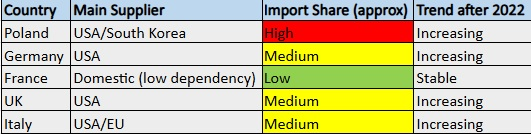

How dependent are major European NATO members on external arms suppliers, and how has this dependence evolved after Russia's full-scale invasion of Ukraine in 2022?

# EU Arms Imports & Dependency Analysis (SIPRI-based)

## Research Question

How dependent are major European NATO members on external arms suppliers, and how has this changed after 2022?

## Methodology

This project uses SIPRI arms transfer data to analyse defence import dependency across selected NATO members. The focus is on identifying supplier concentration and changes following Russia’s full-scale invasion of Ukraine.

## Countries Analysed

- Poland
- Germany
- France
- United Kingdom
- Italy

## Key Findings

- The United States is the dominant external arms supplier for most European NATO members.
- Poland shows the highest increase in external procurement post-2022.
- France remains the most strategically autonomous due to its domestic defence industry.
- Germany and Italy show increased reliance on US systems after 2022.
- The post-2022 period shows accelerated rearmament and procurement shifts across Europe.

## Data Source
- SIPRI Arms Transfers Database (https://sipri.org/databases/armstransfers)

